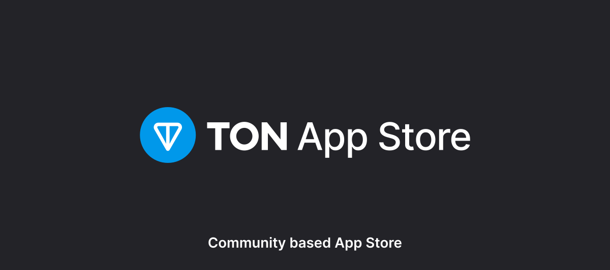
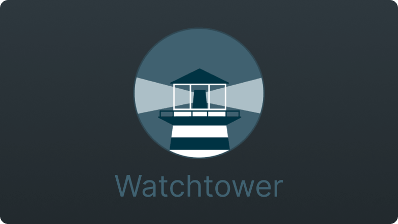

# 💎 TON AppStore

A TON Appstore containing TON Ecosystem images.

## 📃 Table of Contents

- [💎 TON AppStore](#-ton-appstore)
  - [📃 Table of Contents](#-table-of-contents)
  - [🔥 Introduction](#-introduction)
  - [🛠 List of Applications](#-list-of-applications)
  - [Contributing](#contributing)

## 🔥 Introduction

The TON Appstore is **guaranteed to provide you the latest version of every Application** as the appstore automatically tracks new releases and updates the contents of this repository daily.

## 🛠 List of Applications

| #   | Application | Version | Description |
| --- | ----------- | ------- | ----------- |

| App                                                                                                                                                                                                                                                                                                                                                                                                            | Thumbnail                                   |
| :------------------------------------------------------------------------------------------------------------------------------------------------------------------------------------------------------------------------------------------------------------------------------------------------------------------------------------------------------------------------------------------------------------- | ------------------------------------------- |
| <h2> Watchtower</h2>     A container-based solution for automating Docker container base image updates. |  |

## Contributing

Contributing to this Appstore is temporarily not possible at the moment. Please refrain from submitting PRs into this repository.

Updates to this repository is auto-generated by a script.
